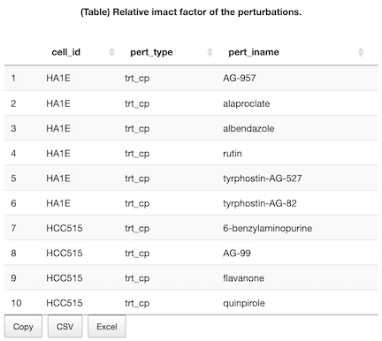

# Tutorial

Created: Mar 1, 2021 12:03 PM
Property: Mar 2, 2021 9:57 AM
Status: Working
Tags: Tutorial

### Summary

The goal of this tutorial is to describe the interface as well as the data that database on the backend. In addition, a brief description of the data and the analysis are give to help the users understand how the output is presented and can be interpreted. Finally, a few suggestions for downstream analysis of the output and how to choose appropriate inputs are given at the end.

### The inputs

This database is built using two main datasets. First, the The Library of Integrated Cellular Signatures (LINCS) database to model the effect of the perturbations on gene expression of cancer cell lines. Second, several causal biological networks (CBN) which are a collection of curated interactions of biological entities in several different biological processes.

Users are encouraged to checkout the relevant documentations of these dataset to understand what they represent and how they were generated. For the propose of using this app, the input panel (Figure 1) provide an easy way to select one or more items from the dataset.

- The cell-specific perturbation

The "Cell" panel enables the user to choose by "Tissue" or individual "Cell Line". Similarily, the "Perturbation" panel can be used to choose perturbations by "Type" or individial perturbations using "Name". The buttons "Reset" and "Feeling Lucky!" would reset the selection fields to the defaults or to random selections of the corresponding entries.

- The causal biological networks

The "Network" panel can be used to select which networks to look up their scores in the selected cell lines and perturbations. Networks are named "Model" and are grouped in "Family". The buttons "Reset" and "Feeling Lucky!" would reset the selection fields to the defaults or to random selections of the corresponding entries.

Figure 1. Input panels. Input panels to select the "cell"-specific "perturbations" to look up their scores in the biological "Networks". All choices are grouped in bigger categories to narrow down the search. "Reset" and "Feeling Lucky!" buttons revert to the defaults or select random items from the available lists. The selection of any entry automatically updates the shown information in the output tabs.

### The analysis

- Differential expression analysis

    The R package Slinky was used to obtain the perturbations data from the LINCS project. For every perturbation in each cell line comparison of treatment vs control was applied using Limma. The fold-change for all genes is calculated along with p-values and used as an input in the next step. In addition, when multiple doses or treatment period of a perturbation is available, a linear model was used to compare the effect of these variables on the gene expression.

- Network perturbation analysis (NPA)
    - The R packages NPA and NPA models were used to obtain the biological networks and apply the network perturbation analysis.
    - A score for each node based on constraint optimization problem that was implemented as matrix multiplication relying on sub-matrices of the signed lablacian matrix of two layers. (Whatever this means!)
    - If the data refelcts the perturbation of the functionl layer,
        - All **differential values** should be close to each other (smooth) and
        - Equal to the observed fold-change $\beta$ in the transcript layer $V_0$.

        $$min_{f\in l^2 (V) \sum_{x\to y}} (f(x)-\sigma(x\to y).f(y))^2 s.t f|_{V_0} = \beta$$

        where $\sigma(x \to y)$ denotes the sign of the edge $x \to y$.

    - The NPA score is computed by summing the results over the edges of the functional layer

    $$NPA = \frac{1}{|E|} \sum_{e\ in\ E} (f(e_0) + \sigma(e)f(e_1))^2$$

    where $E$ is the set of its edges and $|E|$ is its size, $f$ is the solution of the constrained problem, and $e_0$ and $e_1$ denote the start and the end of the edge $e$.

    - Three accompanying statistics
        1. Confidence interval based on the biological variability propagated from uncertainty of the differential gene expression values.
        2. O and K NPA value above the 95% of the null distribution generated by reshuffling the edges of the transcription or function layers, respectively.
    - Interpretation:
        - NPA score: the amplitude of the perturbation as a whole
        - Biological impact factor (BIF) the weighted sum of the scores of the significantly perturbed networks.
        - Leading nodes: the nodes in the functional layer that contribute the most to the NPA scores (> 80%).

### The database

- Getting the data in

    The output of the analysis was extracted from the R6 object returned by the NPA package and transformed to tabular formats and added to an SQLite database file using the DBI package.

- Getting the data out

    The package (DBI) is used to make queries based on the inputs as above and extract the relevant data. These data is passed to the visualization tools (DataTable, ggplot2, plotly, and visNetwork) which are used on the backend of the shiny web applicaiton

### The outputs

- **RBIF**: Relative Biological Impact Factor

- **BIF**: Biological Impact Factor

- **NPA**: Network Perturbation Amplitudes

- **NODES**: the nodes that constitutes the network model

- **GRAPH**: a graph representation of the network model

![Figure 10. Graph representation of the networks models with an option to overlay the perturbation scores. The edges in the network are colored by default into red for positive and green for negative interactions. Selecting a perturbation to overlay, results in coloring the nodes in the network by the direction of perturbation as red for induced and green for repressed. Users can select to show significant perturbations only or resize the nodes by the magnitude of induction/repression. To select a part of the network, users can click on the desired node. Checking "Highlight nearest nodes" highlights the part of the network closes to the selected nodes. Other way to select individual nodes by names or modules (sub-networks) are provided.](Tutorial/Screen_Shot_2021-03-01_at_1.35.13_PM.png)

- **SIMILARITY** (below)

- **DOWNLOAD**: a place to download the data for selected items or the full database files. Clicking the link will result in the download of the corresponding files.

### Downstream Analyses (missing)

### Auxilary Analyses

- Choosing cell lines (missing)
- Choosing perturbations (SIMILARITIES)
    
    The similarity measures can be used to select perturbations in particular cell line that produce similar/opposite effects on gene expression. Currently, only one similarity measure is available. This is the Spearman Correlation Coefficient (SCC). First, users need to select a the "type"" and the "name" of perturbations (Figure 12). The graph (Figure 13) and the table (Figure 14) show the top "number" of perturbations that are most similar to the selected item. 

### References

1. Koleti A, Terryn R, Stathias V, et al (2018) Data Portal for the Library of Integrated Network-based Cellular Signatures (LINCS) program: Integrated access to diverse large-scale cellular perturbation response data. Nucleic Acids Res
2. Slater, T. Recent advances in modeling languages for pathway maps and computable biological networks. Drug Discovery Today 19, 193–198 (2014).
3. Martin F, Gubian S, Talikka M, et al (2019) NPA: An R package for computing network perturbation amplitudes using gene expression data and two-layer networks. BMC Bioinformatics 20:1–9. 
4. Kort EJ (2020). slinky: Putting the fun in LINCS L1000 data analysis. R package version 1.8.0.
5. Ritchie ME, Phipson B, Wu D, Hu Y, Law CW, Shi W, Smyth GK (2015). “limma powers differential expression analyses for RNA-sequencing and microarray studies.” Nucleic Acids Research, 43(7), e47. doi: 10.1093/nar/gkv007.
